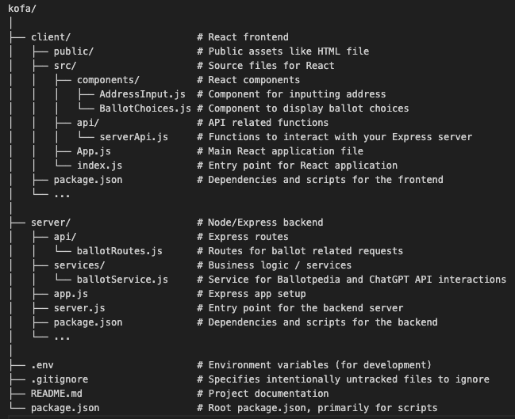

# kofa

## File Structure

## Purpose of this application
To get clear and consise information about upcoming elections and suggestions on what to vote on based on "Foundational Black American" (FBA) conciousness. 

## Current Technology Stack
- React
- Nodejs
- Express
- BallotPedia API
- Open AI API
- MongoDB

## Products
- Chat UI
- API

## Technology Story
- Log into app.
- Use BallotPedia API to pull ballot information by address into cache.
- Call Chatgpt API and have it fetch and choose best choices from the ballot based on voter preferences prompts that come from the profile settings.
- Display this information on the front end of the app.
- Make this information copyable and downloadable.

## User Story
As a user I want too..

- Create a profile containing name, email address, phone number, physical address & voter preferences. 
- I want to immediatly see voter suggestions based on my ballot and the reasons for the choices.
- I want to be able to copy these choices as a cheatsheet or download them as a pdf.