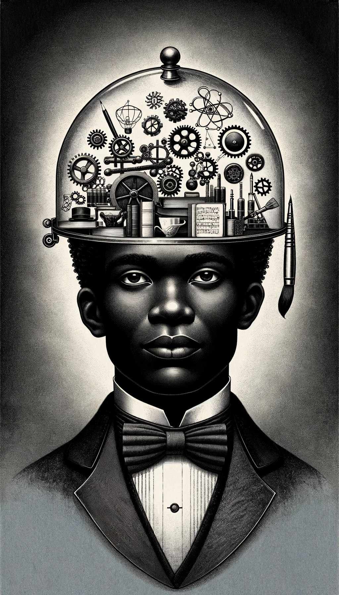
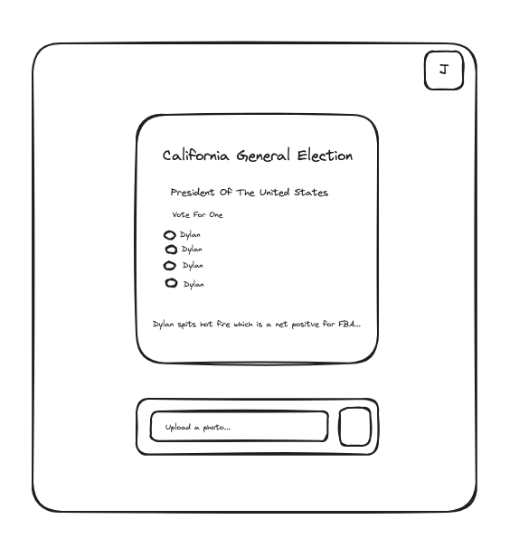

# kofa

## Purpose of this application
To get clear and consise information about upcoming elections and suggestions on what to vote on based on "Foundational Black American" (FBA) conciousness. 

## Current Technology Stack
- React
- Nodejs
- Express
- BallotPedia API
- Langchain
- Open AI API
- MongoDB

## Possible Future Technology Stack
- React
- Streamlit
- BallotPedia API
- Langchain
- Open AI API
- Mongo DB

## User Story
As a user I want too..

- Take a picture of my ballot.
- See my full ballot based on my address.
- See suggestions and reasoning for voting for a candidate or proposition based on the objective net positve benifit to "Foundation Black Americans."
- Have access to additional features if I create an account.