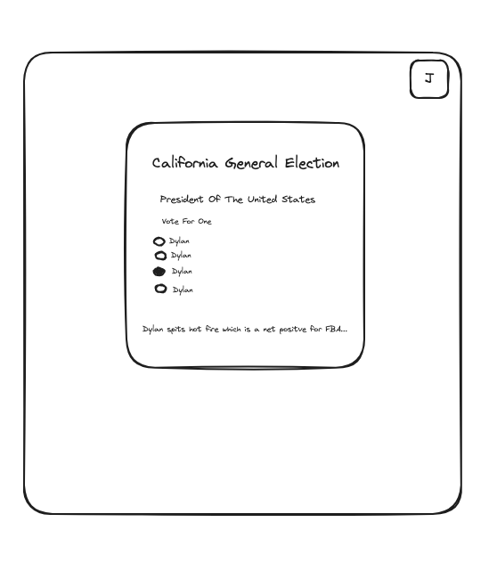

# kofa


## File Structure
```
kofa/
│
├── client/                      # React frontend
│   ├── public/                  # Public assets like HTML file
│   │   └── index.html           # Main HTML file
│   ├── src/                     # Source files for React
│   │   ├── components/          # React components
│   │   │   ├── BallotCard.js    # Component to display a single ballot item
│   │   │   └── BallotList.js    # Component to display list of ballots
│   │   ├── api/                 # API related functions
│   │   │   └── serverApi.js     # Functions to interact with your Express server
│   │   ├── App.js               # Main React application file
│   │   └── index.js             # Entry point for React application
│   ├── package.json             # Dependencies and scripts for the frontend
│   └── ...
│
├── server/                      # Node/Express backend
│   ├── routes/                  # Express routes
│   │   ├── ballotRoutes.js      # Routes for ballot related requests
│   │   └── pdfRoutes.js         # Routes for PDF generation
│   ├── services/                # Business logic / services
│   │   └── ballotService.js     # Service for API integration and data processing
│   ├── scripts/                 # Standalone scripts for scheduled tasks
│   │   └── fetchBallotData.js   # Script to fetch ballot data from Ballotpedia
│   ├── app.js                   # Express app setup
│   ├── server.js                # Main entry point for the server
│   ├── package.json             # Dependencies and scripts for the backend
│   └── ...
│
├── .env                         # Environment variables (for development)
├── .gitignore                   # Specifies intentionally untracked files to ignore
├── README.md                    # Project documentation
└── package.json                 # Root package.json, primarily for scripts


```
## Wireframe (UI)



## Purpose of this application
To get curated voting suggestions for the upcoming 2024 election.


## Summary
I want to take my ballot information based on my location and use a LLM to make decisions on who to vote for based on specific questions answered when creating a profile.


## Technology Stack
- [React](https://react.dev/)
- [Nodejs](https://nodejs.org/en/learn/getting-started/introduction-to-nodejs)
- [Express](https://expressjs.com/)
- [Civic Information API](https://developers.google.com/civic-information) | [Ballotpedia API](https://developer.ballotpedia.org/#elections)
- [OpenAI API](https://platform.openai.com/docs/api-reference)
- [Langchain (Maybe)](https://python.langchain.com/docs/get_started/quickstart)
- [MongoDB (Maybe)](https://www.mongodb.com/docs/drivers/node/current/)
- [AWS (Maybe not needed)](https://docs.aws.amazon.com/)
- [Vercel (Frontend Deployment)](https://vercel.com/docs)
- [Heroku (Backend Deployment)](https://devcenter.heroku.com/categories/reference)
- [Heroku Scheduler (For Cron Jobs)](https://devcenter.heroku.com/articles/scheduler)


## ERD
### Entities
1. User
   - Attributes: UserID, Name, Email, Address


2. Election
   - Attributes: ElectionID, Name, Date, Location


3. BallotItem
   - Attributes: BallotItemID, Title, Description, ElectionID


4. Candidate
   - Attributes: CandidateID, Name, Party, BallotItemID, InfoURL


5. Vote
   - Attributes: VoteID, UserID, BallotItemID, CandidateID, Timestamp


6. UserSelections
   - Attributes: SelectionID, UserID, BallotItemID, CandidateID, Notes


### Relationships
- User to Vote: One-to-Many (A user can cast multiple votes, but each vote is cast by only one user).
- Election to BallotItem: One-to-Many (An election contains multiple ballot items, but each ballot item belongs to one election).
- BallotItem to Candidate: One-to-Many (A ballot item can have multiple candidates, but each candidate is associated with one ballot item).
- User to UserSelections: One-to-Many (A user can have multiple selections, but each selection is associated with one user).
- BallotItem to UserSelections: One-to-Many (A ballot item can be part of multiple user selections, but each selection is for one ballot item).
- Candidate to UserSelections: One-to-Many (A candidate can be chosen in multiple user selections, but each selection is for one candidate).


### ERD Diagram Visualization
- User
   - UserID (PK)
   - Name
   - Email
   - Address


- Election
   - ElectionID (PK)
   - Name
   - Date
   - Location
  
- BallotItem
   - BallotItemID (PK)
   - Title
   - Description
   - ElectionID (FK)
  
- Candidate
   - CandidateID (PK)
   - Name
   - Party
   - BallotItemID (FK)
   - InfoURL
  
- Vote
   - VoteID (PK)
   - UserID (FK)
   - BallotItemID (FK)
   - CandidateID (FK)
   - Timestamp


- UserSelections
   - SelectionID (PK)
   - UserID (FK)
   - BallotItemID (FK)
   - CandidateID (FK)
   - Notes


(PK) denotes a Primary Key, and (FK) denotes a Foreign Key.


## Products
- Desktop App
- iOS App
- Android App
- API


## Technology Story
- Authenticate preferences based on user profile.
- Schedule cron jobs to bring in up-to-date ballot information from the BallotPedia API and store it as JSON files in MongoDB.
- Call Chat Gpt API and have it fetch and choose best choices from the ballot based on voter preferences prompts that come from the profile settings.
- Display this information on the front end of the app.
- Make this information copyable and downloadable.


## User Story
As a user I want too..


- Create a profile containing name, email address, phone number, physical address (latitude/longitude coordinates) & voter preferences.
- Immediately see voter suggestions based on my ballot and the reasons for the choices.
- Be able to copy these choices as a cheatsheet or download them as a pdf.


## Possible Future Features
- Closest polling stations.
- Access to previous year suggestions.
- Real time election results.
- Ability to chat with suggestions.
- iOS and Andriod App

